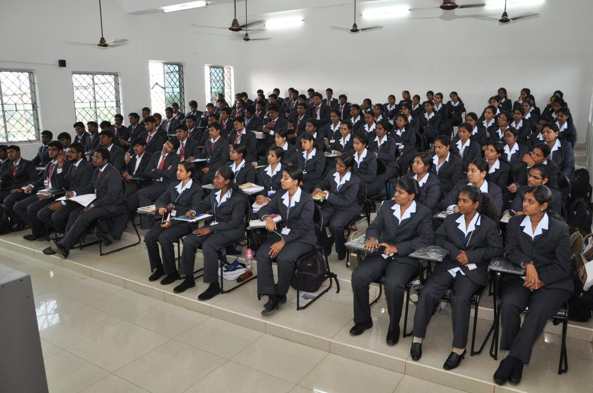

```
<!DOCTYPE html>
<html lang="en">
<head>
    <meta charset="UTF-8">
    <meta name="viewport" content="width=device-width, initial-scale=1.0">
    <title>Gallery</title>
</head>
<body style="background-color: beige;">
    <header>
        
        <h1>Saveetha Name</h1>
        <nav>
            <ul>
                <li><a href="index.html">Home</a></li>
                <li><a href="academics.html">Academics</a></li>
                <li><a href="admission.html">Admission</a></li>
                <li><a href="gallery.html">Gallery</a></li>
            </ul>
        </nav>
    </header>
    <main>
            
            
                    <section>
                        <h2 style="font-style: oblique; font-size: xx-large;"><center>Mission</center></h2>
                        <p style="font-style: italic; font-size: large; text-align: center;">To promote academic excellence; widen intellectual horizon; self-discipline and high ideals for the total personality development of the individual.</p>
                        <h2 style="font-style: oblique; font-size: xx-large;"><center>Vission</center></h2>
                        <p style="font-style: italic; font-size: large; text-align: center;">To be and to be recognized for setting the standard of excellence in engineering education and high quality research in Science and Technology.</p>
                    </section>
                
            

    </main>
</body>
</html>

```
```
<!DOCTYPE html>
<html lang="en">
<head>
    <meta charset="UTF-8">
    <meta name="viewport" content="width=device-width, initial-scale=1.0">
    <title>Academics</title>
</head>
<body style="background-color: rgb(127, 153, 255);">
    <header>
        <center></center>
        <center><h1 style="font-style: oblique; font-size: xx-large;">Saveetha College</h1></center>
        <nav>
            <ul>
                <li><a href="index.html">Home</a></li>
                <li><a href="academics.html">Academics</a></li>
                <li><a href="admission.html">Admission</a></li>
                <li><a href="gallery.html">Gallery</a></li>
            </ul>
        </nav>
    </header>
    <main>
        <section>
        <center><h2 style="font-style: oblique; font-size: xx-large;">Academic Departments</h2></center>
            
               <p style="font-style: inherit; font-size: x-large;">Science</p><br>
                   
                        <a href="courses/computer-science.html">Computer Science</a><br>
                        <a href="courses/mathematics.html">Mathematics</a>
                    
                
                <p style="font-style: inherit; font-size: x-large;">Arts</p><br>
                    
                        <br><a href="courses/english.html">English</a><br>
                        <a href="courses/sociology.html">Sociology</a>
                    
             
                <p style="font-style: inherit; font-size: x-large;">Commerce</p><br>
                    <br><a href="courses/economics.html">Economics</a><br>
                        <a href="courses/business-management.html">Business Management</a>
                    
        </section>
    </main>
</body>
</html>

```
```
<!DOCTYPE html>
<html lang="en">
<head>
    <meta charset="UTF-8">
    <meta name="viewport" content="width=device-width, initial-scale=1.0">
    <title>Gallery</title>
</head>
<body style="background-color: beige;">
    <header>
        
        <h1>Saveetha Name</h1>
        <nav>
            <ul>
                <li><a href="index.html">Home</a></li>
                <li><a href="academics.html">Academics</a></li>
                <li><a href="admission.html">Admission</a></li>
                <li><a href="gallery.html">Gallery</a></li>
            </ul>
        </nav>
    </header>
    <main>
        <section>
            <h2>Gallery</h2>
            <div>
                
                
                
            </div>
        </section>
    </main>
</body>
</html>

```

```
<!DOCTYPE html>
<html lang="en">
<head>
    <meta charset="UTF-8">
    <meta name="viewport" content="width=device-width, initial-scale=1.0">
    <title>Admission </title>
</head>
<body style="background-color: bisque;">
    <header>
        
        <h1>Saveetha College</h1>
        <nav>
            <ul>
                <li><a href="index.html">Home</a></li>
                <li><a href="academics.html">Academics</a></li>
                <li><a href="admission.html">Admission</a></li>
                <li><a href="gallery.html">Gallery</a></li>
            </ul>
        </nav>
    </header>
    <main>
        <section>
            <h2>Admission Form</h2>
            <form>
                <label for="name">Full Name:</label>
                <input type="text" id="name" name="name" required><br>

                <label for="email">Email:</label>
                <input type="email" id="email" name="email" required><br>

                <label for="phone">Phone Number:</label>
                <input type="tel" id="phone" name="phone" required><br>


                
                <label for="dob">Date of Birth:</label>
                <input type="date" id="dob" name="dob" required><br>

                <label for="course">Course Interested:</label>
                <select id="course" name="course">
                    <option value="computer-science">Computer Science</option>
                    <option value="mathematics">Mathematics</option>
                    <option value="english">English</option>
                    <option value="sociology">Sociology</option>
                    <option value="economics">Economics</option>
                    <option value="business-management">Business Management</option>
                </select><br>

                <label for="address">Address:</label>
                <textarea id="address" name="address" required></textarea><br>

                <button type="submit">Submit</button>
            </form>
        </section>
    </main>
</body>
</html>


```
## output


